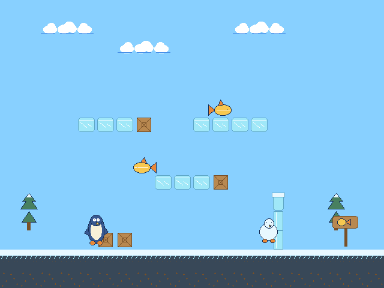

# PAP Render

A command-line pixel art renderer that composites a scene from a tile-based background and a list of sprites, exporting the result as a PNG image.

**Stato**: funzionalità complete. Il codice è funzionante e testato; eventuali interventi futuri riguarderanno refactoring, pulizia o ottimizzazioni.

## Output



## Overview

- 16-color indexed palette (4 bit per pixel)
- Tile sheet: 64 tiles of 32×32 pixels in a 256×256 image
- Sprite sheet: 16 sprites of 64×64 pixels in a 256×256 image
- Frame buffer: 640×480 pixels (tile map 15×20)
- Sprite transformations: flip on x/y axis, rotation by 90/180/270 degrees
- Transparency via a designated palette index

## Usage

```bash
python main.py <palette.json> <scene.json> <tiles.bin> <sprites.bin> <output.png>
```

| Argument | Description |
|---|---|
| `palette.json` | 16 RGB colors |
| `scene.json` | transparent index, tile map, sprite list |
| `tiles.bin` | packed binary tile sheet (32768 bytes) |
| `sprites.bin` | packed binary sprite sheet (32768 bytes) |
| `output.png` | rendered output |

## Input Format

### palette.json

Array of 16 RGB colors:

```json
[
  [0, 0, 0],
  [255, 0, 0],
  ...
]
```

### scene.json

```json
{
  "transparent_index": 0,
  "tile_map": [[1, 0, 2, ...], ...],
  "sprites": [
    { "id": 0, "x": 100, "y": 80, "flip_x": false, "flip_y": false, "rotation": 0 }
  ]
}
```

- `transparent_index`: palette index (0–15) treated as transparent for all sprites
- `tile_map`: 15×20 matrix of tile IDs (0–63)
- `sprites`: ordered list — draw order determines z-order

### .bin files

Packed binary, 256×256 pixels stored as 32768 bytes. Each byte contains 2 pixels:
- high nibble (bits 7–4): first pixel → palette index 0–15
- low nibble (bits 3–0): second pixel → palette index 0–15

## Architecture

| Class | Responsibility | Status |
|---|---|---|
| `Palette` | Reads and validates `palette.json`, maps index → RGB | Done |
| `VirtualVRAM` | Loads `.bin` files, decodes nibble-packed pixels into index matrices; exposes `get_tile(id)` and `get_sprite(id)` | Done |
| `SceneParser` | Reads and validates `scene.json`, returns `transparent_index`, `tile_map`, and `sprites` | Done |
| `Blitter` | Composites tiles and sprites onto a 640×480 frame buffer; applies flip/rotation and transparency | Done |
| `RenderingPipeline` | Orchestrates the full render and exports PNG | Done |

Custom exceptions (`PaletteError`, `VRAMError`, `SceneError`, `BlitterException`, `RenderingException`) are raised for all invalid input cases. `FileNotFoundError` propagates with a descriptive message from all file-loading classes.

## API Reference

### Palette

```python
Palette(path: str)
```

| Member | Type | Description |
|---|---|---|
| `data` | `np.ndarray (16, 3) uint8` | Full palette array |
| `__getitem__(idx: int)` | `np.ndarray (3,) uint8` | RGB color at palette index `idx` ∈ [0, 15] |
| `print_palette()` | `None` | Prints palette to stdout |

Raises `PaletteError` on invalid palette. Raises `FileNotFoundError` if file is missing.

---

### VirtualVRAM

```python
VirtualVRAM(path_t: str, path_s: str)
```

| Member | Type | Description |
|---|---|---|
| `get_tile(idx: int)` | `np.ndarray (32, 32) uint8` | Palette-index matrix for tile `idx` ∈ [0, 63] |
| `get_sprite(idx: int)` | `np.ndarray (64, 64) uint8` | Palette-index matrix for sprite `idx` ∈ [0, 15] |

Raises `VRAMError` on invalid file size. Raises `FileNotFoundError` if a file is missing.

---

### SceneParser

```python
SceneParser(path: str)
```

| Member | Type | Description |
|---|---|---|
| `transparent_index` | `int` | Palette index treated as transparent, ∈ [0, 15] |
| `tile_map` | `np.ndarray (15, 20) uint8` | Grid of tile IDs |
| `sprites` | `list[dict]` | Ordered sprite list; each dict has `id`, `x`, `y`, `flip_x`, `flip_y`, `rotation` |

Raises `SceneError` on invalid scene. Raises `FileNotFoundError` if file is missing.

---

### Blitter

```python
Blitter(vram: VirtualVRAM, asset_type: str, idx: int, transparent_index: int, buffer: np.ndarray)
```

| Member | Type | Description |
|---|---|---|
| `transparent_index` | `int` | Palette index treated as transparent |
| `_buffer` | `np.ndarray (480, 640) uint8` | Shared frame buffer written in place |
| `blit_tile(row: int, col: int)` | `None` | Copies tile onto buffer at tilemap cell (`row` ∈ [0,14], `col` ∈ [0,19]) |
| `blit_sprite(x, y, flip_x, flip_y, rotation)` | `None` | Transforms and blits sprite at top-left `(x, y)`; transparent pixels are skipped |
| `_transform(sprite_matrix, flip_x, flip_y, rotation)` | `np.ndarray (64, 64) uint8` | Applies flip then rotation to a sprite matrix |
| `_clip(x: int, y: int)` | `tuple[tuple[slice, slice], tuple[slice, slice]]` | Returns `(dst, src)` slice pairs for a 64×64 sprite at `(x, y)` |

Raises `BlitterException` on invalid arguments.

---

### RenderingPipeline

```python
RenderingPipeline(palette_path, scene_path, tiles_path, sprites_path, output_path)
```

| Member | Type | Description |
|---|---|---|
| `get_buf()` | `np.ndarray (480, 640) uint8` | classmethod — creates a blank frame buffer |
| `render()` | `None` | Runs full pipeline: compose tiles + sprites, export PNG |
| `_compose(buf: np.ndarray)` | `None` | Fills `buf` with tiles then sprites in scene order |
| `_export(buf: np.ndarray)` | `None` | Maps palette indexes → RGB, saves PNG via Pillow |

Raises `RenderingException` on pipeline errors.

## Requirements

- Python ≥ 3.14
- `Pillow` used only for PNG export
- `numpy` arrays with `np.uint8` dtype

## Project Structure

```
.
├── main.py               # CLI entry point
├── classes.py            # Palette, VirtualVRAM, SceneParser, Blitter, RenderingPipeline
├── tests.py              # Test suite (133 tests, all passing)
├── input/                # Example input files (palette, scene, tiles, sprites)
├── output/               # Rendered PNG output goes here
├── test_data/
│   ├── palette_ok.json             # Valid 16-color palette
│   ├── palette_wrong_count.json    # Only 3 colors (invalid)
│   ├── palette_wrong_value.json    # Component > 255 (invalid)
│   ├── test_boundary_values/       # Per-test directories generated at runtime
│   ├── test_vram_load_ok/          # Each contains the files written by that test
│   └── ...                         # (one subdirectory per test that writes files)
└── pyproject.toml
```

## Tests

```bash
uv run pytest tests.py -v
```

133 tests covering all classes:

**Palette (16 tests)**
- Happy path: load, `__getitem__` first/last, boundary values (0 and 255)
- File errors: file not found, invalid JSON
- Wrong color count: too few, too many, empty
- Wrong color format: fewer than 3 components, more than 3 components
- Out-of-range values: above 255, negative, exact 255
- `__getitem__` bounds: index 16 and index −1

**VirtualVRAM — decode (8 tests)**
- Happy path: load, shape and dtype, all-zeros decode, all-`0xFF` decode, nibble split (`0xAB` → 10, 11)
- File errors: tiles not found, sprites not found
- Wrong size: tiles file too short, sprites file too short

**VirtualVRAM — get_tile (7 tests)**
- Happy path: shape and dtype, first tile (id 0) all 15, last tile (id 63) all 15
- Isolation: tile 5 filled, tile 0 untouched
- Errors: non-int id, id 64, id −1

**VirtualVRAM — get_sprite (7 tests)**
- Happy path: shape and dtype, first sprite (id 0) all 15, last sprite (id 15) all 15
- Isolation: sprite 7 filled, sprite 0 untouched
- Errors: non-int id, id 16, id −1

**SceneParser (28 tests)**
- Happy path: load, transparent_index, tile_map shape and dtype, sprites list, boundary transparent_index 15, empty sprites, sprite fields
- File errors: file not found, invalid JSON
- Missing keys: transparent_index, tile_map, sprites
- transparent_index errors: not int, too high (16), negative
- tile_map errors: wrong rows, wrong cols, jagged rows, value 64, negative value
- sprites errors: not a list, missing field, id not int, id out of range, x/y not int, flip_x/flip_y not bool, rotation not int, rotation invalid (45)

**Blitter (46 tests)**
- init/_validate: valid tile/sprite, all error cases (asset_type, idx, transparent_index)
- blit_tile: correct write and position, all error cases (row/col type and bounds)
- _transform: identity, flip_x, flip_y, rotation 90/180/270, flip_x+y
- _clip: fully inside, centered, clipping on all 4 sides, sprite fully outside frame
- blit_sprite: all-opaque, all-transparent, mixed transparency, position, clipping on all 4 sides, fully outside frame on all 4 sides, transform+clip combined, z-order

**RenderingPipeline (17 tests)**
- get_buf: shape, dtype, all zeros, independence between calls
- __repr__: all 5 paths present
- _export: file created, image size 640×480, pixel color maps correctly from palette
- _compose: tiles written, full tile_map filled, sprite over tile, transparent sprite not drawn, sprite z-order, sprite transformation applied, sprite clipping at frame edge
- render(): output file created, output size 640×480

**main.py (4 tests)**
- `--help` exits with code 0
- missing arguments exits with non-zero code
- valid input runs and creates output file
- invalid file paths propagate `FileNotFoundError`
